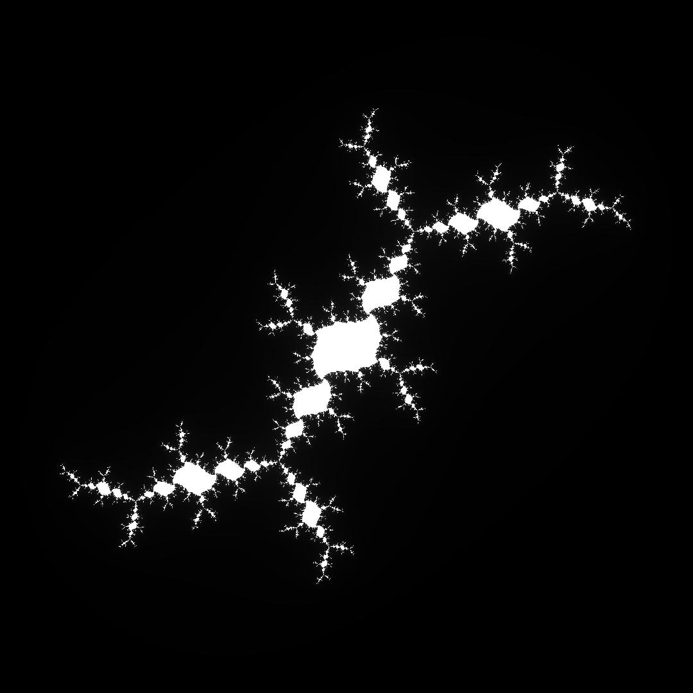
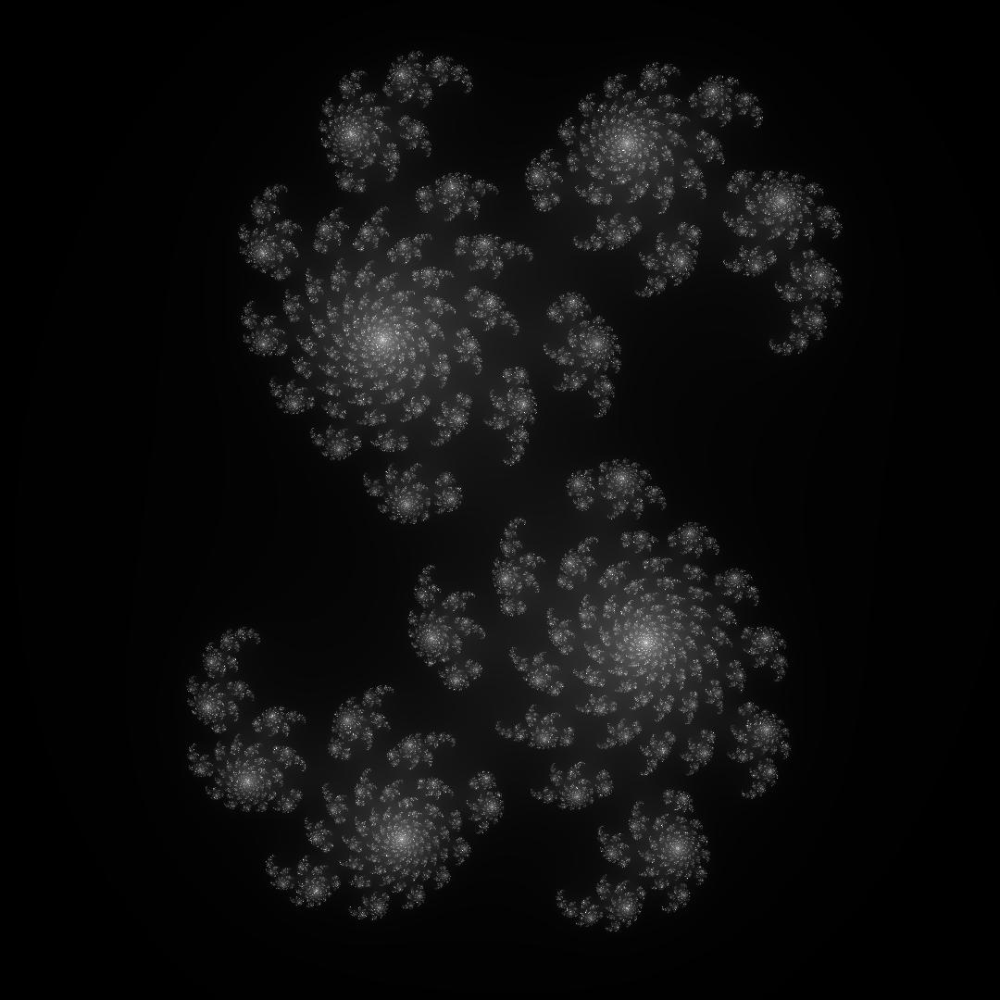
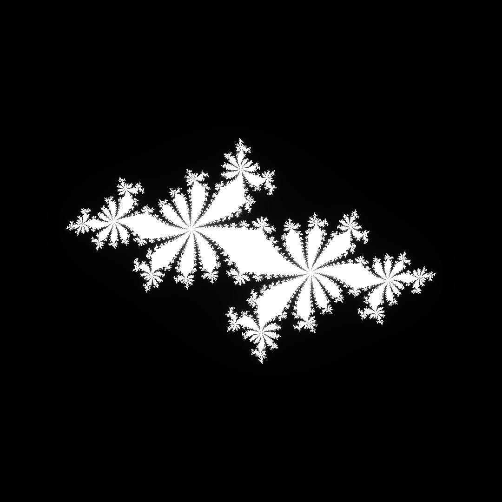

# Fraktale

Ermöglicht die Berechnung und Darstellung von Juliamengen und der Mandelbrotmenge.


Juliamenge zur komplexen Zahl 0.3222222222222224+0.5666666666666667i mit Graustufenadapter.


Mandelbrotmenge mit dem Adapter: 
```python 
from Fraktale.SinusAdapter import *
FarbadapterSin(anteile=SinusFarbanteil(-0.99999, -1.12, 2.32))
```



Juliamenge zur komplexen Zahl -0.125925925925926-0.8629629629629632i.



Juliamenge zur komplexen Zahl 0.3740740740740742-0.12592592592592577i.



Juliamenge zur komplexen Zahl -0.674074074074074+0.3407407407407408i

## Welten

Eine Welt beschreibt die Berechnungsvorschrift für ein Fraktal.

Vordefinierte Mengen sind die Mandelbrotmenge und die Juliamenge.

### Mandelbrotmenge
Zur Erstellung sind lediglich die Abmessungen des realen Bildschirms erforderlich.

### Juliamengen
Es gibt nicht nur eine, sondern sehr viele Juliamenge.
Zur Erstellung werden die Bildschirmabmessungen, die komplexe Zahl c zu der die Menge erstellt werden soll, 
und optional die Iterationszahl und die Funktion, mit der die Menge berechnet werden soll.

## Treiber
Treiber sind der visuelle Output einer theoretischen Welt.
Vordefiniert ist der Tkinter-Treiber, der die Abmessungen, die Welt und einen Farbadapter benoetigt.

## Farbadapter
Welten liefern für jeden Pixel einen berechneten Wert zwischen 0 und 1.

Um diesen Wert in eine Farbe umzuwandeln, die angezeigt werden kann, werden Adapter benötigt.

### Sinus-Adapter
Die einzelnen Werte für Rot, Grün und Blau werden über die Sinusfunktion angenähert.
Der Offset jeder Farbe kann über die dataclass SinusFarbanteil angegeben werden.

## Erstellung einer Tkinter-Darstellung
### Darstellung einer Juliamenge
```python
from Fraktale import make_tkinter, Welten
from Fraktale.Farbadapter import GraustufenFarbadapter


if __name__ == "__main__":
    treiber = make_tkinter(
        Welten.JuliaWelt,
        GraustufenFarbadapter(),
        1080, 1080, 
        c=0.3222222222222224+0.5666666666666667j, 
        f=lambda z, c: z ** 2 + c
    )
    treiber.start_loop()

```
### Darstellung der Mandelbrotmenge
```python
from Fraktale import make_tkinter, Welten
from Fraktale.Farbadapter import GraustufenFarbadapter


if __name__ == "__main__":
    treiber = make_tkinter(
        Welten.MandelbrotWelt,
        GraustufenFarbadapter(),
        1080, 1080
    )
    treiber.start_loop()

```